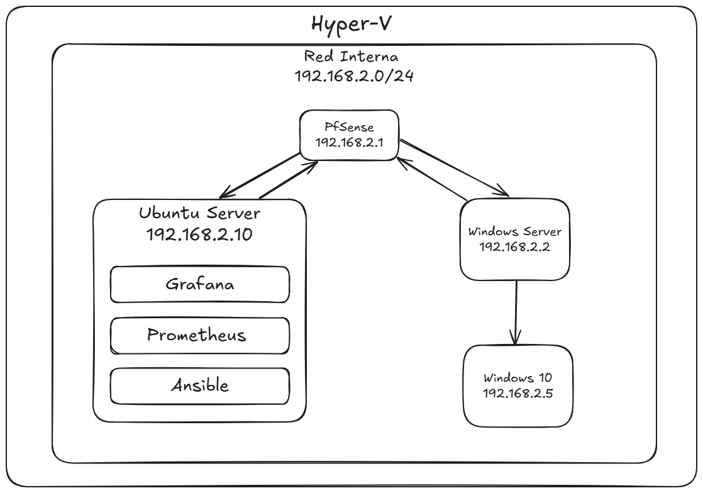
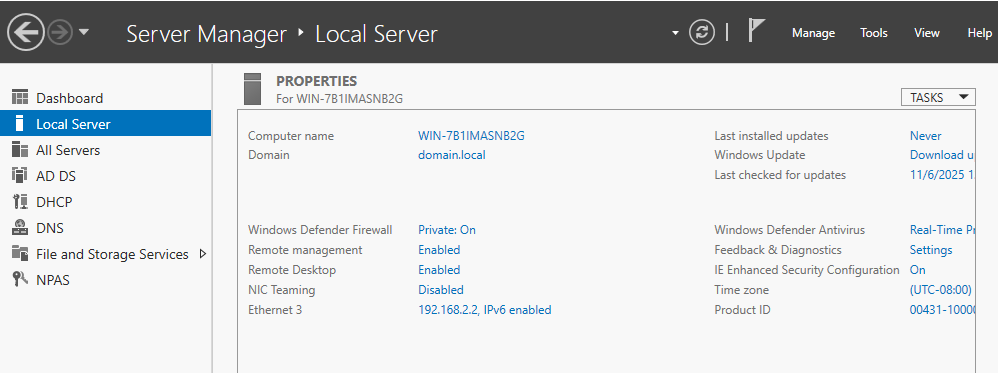
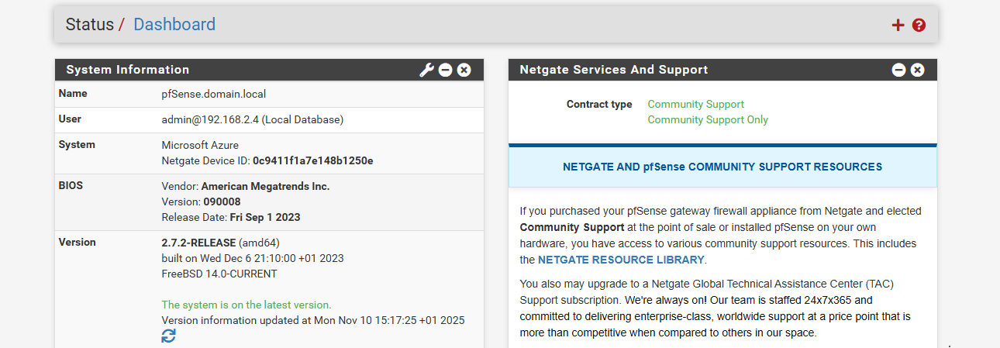
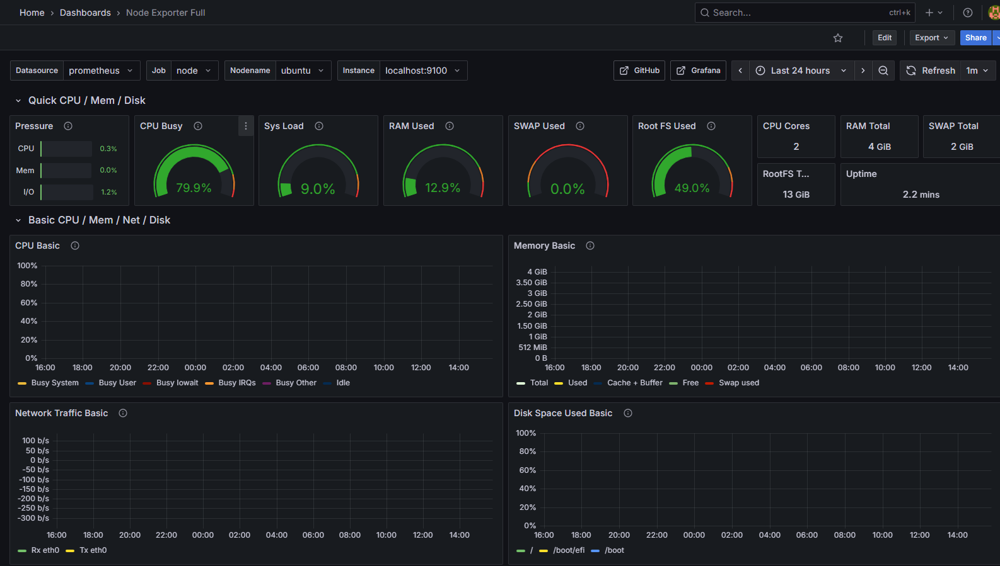

# Home Lab – Windows Server, Ubuntu Server, pfSense, Prometheus & Grafana

**Home lab** montado en Hyper-V sobre Windows 11, incluyendo Windows Server, Ubuntu Server, pfSense, Active Directory, DHCP, GPO y monitorización con Prometheus y Grafana. 

---

## 1. Diagrama de red



*Todas las VMs están conectadas a un switch interno de Hyper-V.*

- **pfSense LAN:** 192.168.2.1  
- **Windows Server 2022:** 192.168.2.2  
- **Ubuntu Server (Prometheus/Grafana/Node Exporter):** 192.168.2.10  
- **Windows 10 Client (AD/DHCP test):** 192.168.2.20 (DHCP)

---

## 2. Windows Server – Active Directory, DNS, DHCP y GPO



- Instalé **Windows Server 2022** con IP estática `192.168.2.2`.  
- Configuré **Active Directory (AD DS)** con dominio `domain.local` y controlador de dominio con DNS integrado.  
- Configuré **DHCP** para la red interna (`192.168.2.0/24`) para que los clientes obtengan IP automáticamente.  
- Agregué un **Windows 10 Client** a la red interna, que recibió IP vía DHCP (`192.168.2.5`) y se unió al dominio `domain.local`.  
- Configuré **Group Policy Objects (GPO)** para aplicar políticas de seguridad y escritorio al Windows 10 Client:
  - Configuración de contraseñas
  - Scripts de inicio de sesión
  - Restricciones de acceso a carpetas y unidades  

---

## 3. pfSense – Firewall y red interna



- Instalé **pfSense 2.7** en VM con LAN IP `192.168.2.1` y WAN conectada al host.  
- Configuré la red interna y aseguré conectividad con todas las VMs.  
- Activé **SNMP** para fines de monitoreo futuro (community: `public`).  
- Configuré reglas de firewall para permitir tráfico interno (ICMP y SNMP).  

---

## 4. Ubuntu Server – Prometheus, Grafana y Node Exporter



- Instalé **Ubuntu Server 22.04** en VM con IP `192.168.2.10`.  
- Instalé **Prometheus** y configuré `prometheus.yml` para recolectar métricas de Node Exporter local:
  ```yaml
  scrape_configs:
    - job_name: 'node_exporter'
      static_configs:
        - targets: ['192.168.2.10:9100']


## 5. Automatización con Ansible

- Instalé **Ansible** en Ubuntu Server (`192.168.2.10`) para automatizar configuraciones de Ubuntu y Windows Server.  
- Configuré el inventario con las VMs del laboratorio:

  - Ubuntu Server: 192.168.2.10
  - Windows Server 2022: 192.168.2.2 (WinRM habilitado)

- Ejemplo de playbook ejecutado:

```yaml
- name: Configure Ubuntu Servers
  hosts: ubuntu_servers
  tasks:
    - name: Install htop
      apt:
        name: htop
        state: present

- name: Configure Windows Servers
  hosts: windows_servers
  tasks:
    - name: Install Notepad++
      win_chocolatey:
        name: notepadplusplus
        state: present
